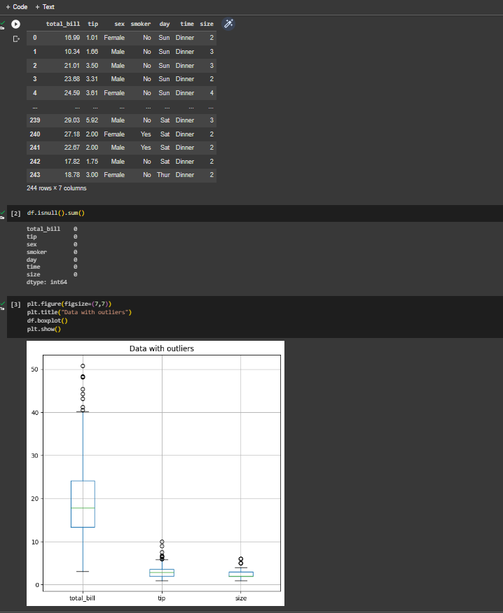
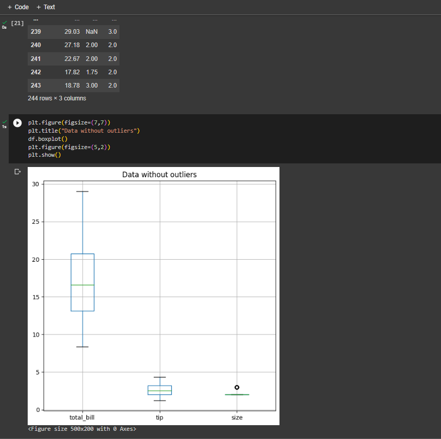
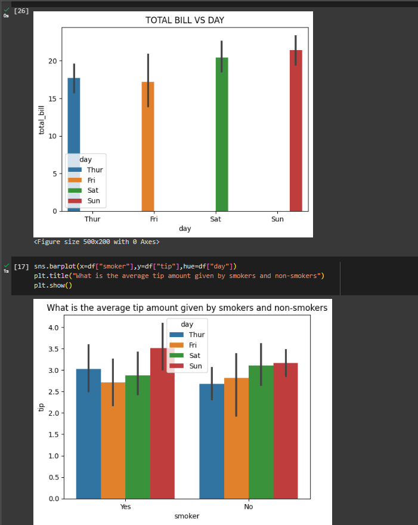
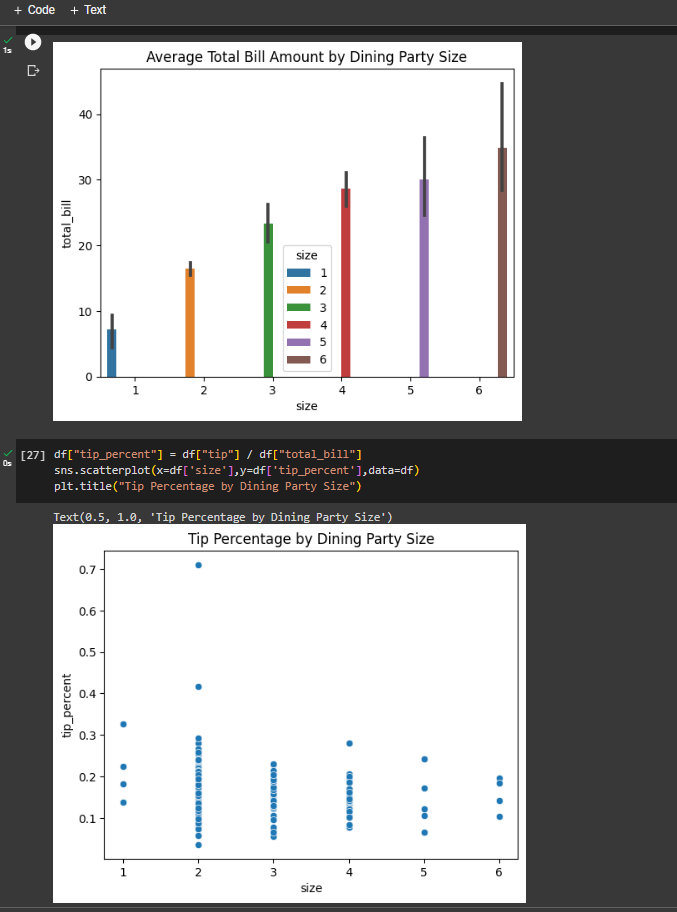
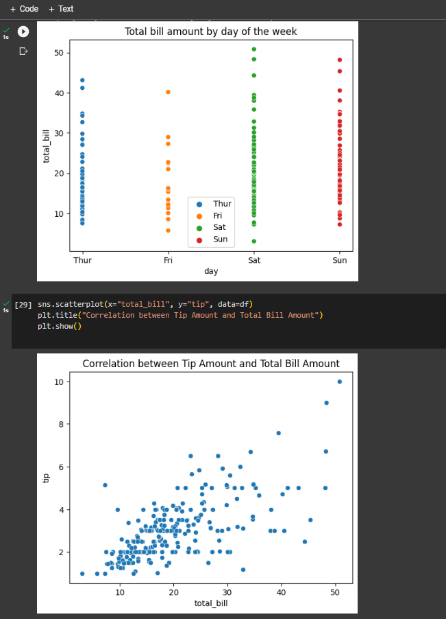
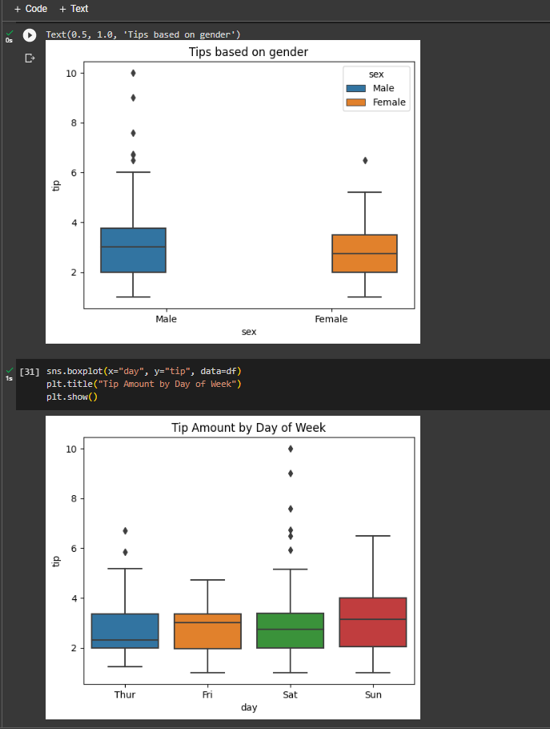
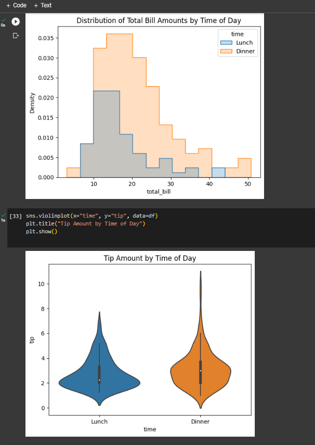

# Ex-09-Data-Visualization-

## AIM
To Perform Data Visualization on a complex dataset and save the data to a file. 

# Explanation
Data visualization is the graphical representation of information and data. By using visual elements like charts, graphs, and maps, data visualization tools provide an accessible way to see and understand trends, outliers, and patterns in data.

# ALGORITHM
### STEP 1
Read the given Data
### STEP 2
Clean the Data Set using Data Cleaning Process
### STEP 3
Apply Feature generation and selection techniques to all the features of the data set
### STEP 4
Apply data visualization techniques to identify the patterns of the data.


# CODE
### Importing necessary packages and loading the dataset.
```python
import pandas as pd
import seaborn as sns
import matplotlib.pyplot as plt
df=sns.load_dataset("tips")
df
```
### Checking for null values.
```python
df.isnull().sum()
```
### Dropping unnecessary columns.
```python
df=df.drop(['sex','smoker','day','time'],axis=1,inplace=True)
```
### Checking for outliers.
```python
plt.figure(figsize=(7,7))
plt.title("Data with outliers")
df.boxplot()
plt.show()
```
### Removal of outliers.
```python
cols=['size','tip','total_bill']
q1=df.quantile(0.75)
q3=df.quantile(0.25)
iqr=q3-q1
low=q1+1.5*iqr
high=q3-1.5*iqr
df=df[(df[cols]>low)&(df[cols]<high)]
df
```
```python
plt.figure(figsize=(7,7))
plt.title("Data without outliers")
df.boxplot()
plt.show()
```
### Data Visualization.
#### Barplot.
```python
sns.barplot(x=df["day"],y=df["total_bill"],hue=df["day"])
plt.title("TOTAL BILL VS DAY")
plt.show()
```
```python
sns.barplot(x=df["smoker"],y=df["tip"],hue=df["day"])
plt.title("Average tip amount given by smokers and non-smokers")
plt.show()
```
```python
sns.barplot(x=df['size'],y=df['total_bill'],hue=df['size'])
plt.title("Average Total Bill Amount by Dining Party Size")
plt.show()
```
#### Scatterplot.
```python
df["tip_percent"] = df["tip"] / df["total_bill"]
sns.scatterplot(x=df['size'],y=df['tip_percent'],data=df)
plt.title("Tip Percentage by Dining Party Size")
```
```python
sns.scatterplot(x=df['day'],y=df['total_bill'],hue=df['day'])
plt.legend(loc="best")
plt.title("Total bill amount by day of the week")
```
```python
sns.scatterplot(x="total_bill", y="tip", data=df)
plt.title("Correlation between Tip Amount and Total Bill Amount")
plt.show()
```
#### Boxplot.
```python
sns.boxplot(x=df['sex'], y=df['tip'],hue=df['sex'])
plt.title("Tips based on gender")
```
#### Histogram.
```python
sns.histplot(data=df, x="total_bill", hue="time", element="step", stat="density")
plt.title("Distribution of Total Bill Amounts by Time of Day")
```
#### Violinplot.
```python
sns.violinplot(x="time", y="tip", data=df)
plt.title("Tip Amount by Time of Day")
plt.show()
```
# OUTPUT








# RESULT
Thus, Data Visualization on a complex dataset and saving the data to a file is successfully performed. 
